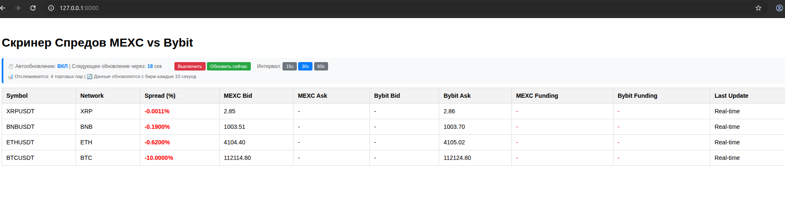

# 📊 Скринер Спредов для MEXC и Bybit Spot

Веб-приложение для мониторинга арби## 📸 Интерфейс приложения

### Главный дашборд
Дашборд показывает:
- **Symbol** - торговая пара (например, BTCUSDT, ETHUSDT)
- **Network** - сокращенное название криптовалюты
- **Spread (%)** - процентный спред между биржами (отрицательные значения показаны красным)
- **MEXC Bid** - цена покупки на бирже MEXC
- **Bybit Ask** - цена продажи на бирже Bybit  
- **Таймер автообновления** - обратный отсчет до следующего обновления данных

### Особенности интерфейса:
- 🔄 **Автообновление каждые 15 секунд** с визуальным таймером
- 🎯 **Цветовая индикация спредов** (красный для отрицательных)
- ⏸️ **Пауза обновления** при наведении на таймер
- 📱 **Адаптивный дизайн** для мобильных устройствей между биржами MEXC и Bybit Spot в реальном времени.


*Интерфейс дашборда с реальными данными спредов между биржами*

## 🚀 Возможности

- **Мониторинг спредов в реальном времени** между биржами MEXC и Bybit
- **Автоматическое обновление данных** каждые 10 секунд
- **Веб-интерфейс** с удобной таблицей результатов и автообновлением
- **Таймер обратного отсчета** до следующего обновления данных
- **Конфигурируемый список торговых пар** для мониторинга
- **REST API** для программного доступа к данным
- **Анализ фандинговых ставок** (обновление каждые 60 секунд)
- **Расчет потенциальной прибыли** от арбитража

## 📁 Структура проекта

```
spread_screener/
├── app.py              # Основное FastAPI приложение
├── config.py           # Конфигурация API endpoints и интервалов
├── exchanges.py        # Модули для работы с API бирж
├── logic.py            # Бизнес-логика расчета спредов
├── models.py           # Pydantic модели данных
├── requirements.txt    # Python зависимости
├── templates/          # HTML шаблоны
│   └── dashboard.html  # Веб-интерфейс дашборда
├── docs/               # Документация и ресурсы
│   └── dashboard-interface.png  # Скриншот интерфейса
└── README.md          # Этот файл
```

## 🛠 Установка и запуск

### Требования

- Python 3.8+
- pip (менеджер пакетов Python)

### Быстрый старт

1. **Клонируйте репозиторий:**
   ```bash
   git clone https://github.com/monarch-up/spread_screener.git
   cd spread_screener
   ```

2. **Создайте виртуальное окружение:**
   ```bash
   python -m venv .venv
   ```

3. **Активируйте виртуальное окружение:**
   ```bash
   # Linux/macOS
   source .venv/bin/activate
   
   # Windows
   .venv\Scripts\activate
   ```

4. **Установите зависимости:**
   ```bash
   pip install -r requirements.txt
   ```

5. **Запустите приложение:**
   ```bash
   python app.py
   ```

6. **Откройте в браузере:**
   - Главная страница: http://localhost:8000
   - Dashboard: http://localhost:8000/dashboard
   - API документация: http://localhost:8000/docs

## � Интерфейс приложения

### Главный дашборд
Дашборд показывает:
- **Symbol** - торговая пара (например, BTCUSDT, ETHUSDT)
- **Network** - сокращенное название криптовалюты
- **Spread (%)** - процентный спред между биржами (отрицательные значения показаны красным)
- **MEXC Bid** - цена покупки на бирже MEXC
- **Bybit Ask** - цена продажи на бирже Bybit  
- **Таймер автообновления** - обратный отсчет до следующего обновления данных


### Особенности интерфейса:
- 🔄 **Автообновление каждые 15 секунд** с визуальным таймером
- 🎯 **Цветовая индикация спредов** (красный для отрицательных)
- ⏸️ **Пауза обновления** при наведении на таймер
- 📱 **Адаптивный дизайн** для мобильных устройств

## �📦 Зависимости

Проект использует следующие Python пакеты:

- **FastAPI** - современный веб-фреймворк для создания API
- **Uvicorn** - ASGI сервер для запуска FastAPI приложений
- **httpx** - современный HTTP клиент для асинхронных запросов
- **Pydantic** - валидация данных с использованием типов Python
- **Jinja2** - шаблонизатор для рендеринга HTML

## 🔧 Настройка

### Конфигурация API endpoints

Основные настройки находятся в файле `config.py`:

```python
# Интервалы обновления данных (в секундах)
SPREAD_UPDATE_INTERVAL = 10       # Обновление спредов каждые 10 секунд
FUNDING_UPDATE_INTERVAL = 60      # Обновление фандинга каждые 60 секунд

# Список символов для мониторинга спредов
SYMBOLS_TO_MONITOR = [
    "BTCUSDT", "ETHUSDT", "ADAUSDT", "SOLUSDT",
    # ... добавьте или удалите символы по необходимости
]
```

### Настройка списка монет для скрининга

В файле `config.py` находится список `SYMBOLS_TO_MONITOR`, который определяет, какие торговые пары будут отслеживаться для анализа спредов. По умолчанию включены 20 популярных криптовалютных пар:

- **Major coins**: BTC, ETH, ADA, SOL, DOT, LINK
- **DeFi tokens**: AAVE, UNI, MATIC
- **Layer 1**: AVAX, ATOM, ALGO, TRX
- **Traditional crypto**: XRP, LTC, BCH, EOS, XLM
- **Storage/Utility**: FIL, VET

Для изменения списка отслеживаемых монет:
1. Откройте файл `config.py`
2. Найдите переменную `SYMBOLS_TO_MONITOR`
3. Добавьте или удалите символы согласно вашим потребностям
4. Перезапустите приложение

### Переменные окружения

Приложение поддерживает следующие переменные окружения:

- `PORT` - порт для запуска сервера (по умолчанию: 8000)
- `DEBUG` - режим отладки (по умолчанию: false)

Пример запуска с кастомными настройками:
```bash
PORT=8080 DEBUG=true python app.py
```

## 🌐 API Endpoints

### Веб-интерфейс

- `GET /` - Главная страница с дашбордом
- `GET /dashboard` - Страница дашборда

### REST API

- `GET /api/instruments` - Получить список всех инструментов
- `GET /api/instruments/{symbol}` - Получить данные по конкретному инструменту
- `GET /api/instruments/{symbol}/chart` - Получить исторические данные для графика
- `GET /api/orderbook/mexc/{symbol}` - Получить стакан ордеров MEXC
- `GET /api/orderbook/bybit/{symbol}` - Получить стакан ордеров Bybit

#### Параметры запросов

- `limit` (int) - ограничить количество результатов
- `sort_by` (str) - сортировка: "spread", "funding", "margin"
- `min_spread` (float) - минимальный спред для фильтрации

Пример запроса:
```bash
curl "http://localhost:8000/api/instruments?limit=10&sort_by=spread&min_spread=0.1"
```

## 📊 Модели данных

### Instrument (Инструмент)
```python
{
    "symbol": "BTCUSDT",
    "mexc_price": 43500.50,
    "bybit_price": 43520.30,
    "spread": 0.45,
    "margin": 19.80,
    "mexc_funding": 0.0001,
    "bybit_funding": 0.0002,
    "last_updated": "2025-09-29T10:30:00Z"
}
```

### OrderBook (Стакан ордеров)
```python
{
    "symbol": "BTCUSDT",
    "exchange": "mexc",
    "bids": [
        {"price": 43500.50, "quantity": 1.25}
    ],
    "asks": [
        {"price": 43501.00, "quantity": 0.85}
    ],
    "timestamp": "2025-09-29T10:30:00Z"
}
```

## 🔍 Мониторинг и логирование

Приложение автоматически выводит логи в консоль:

- Информация о запуске сервера
- Статус обновления данных
- Ошибки подключения к API бирж

### Веб-интерфейс

**Автообновление дашборда:**
- Страница автоматически обновляется каждые 15 секунд
- Таймер обратного отсчета показывает время до следующего обновления
- При наведении на таймер пауза автообновления
- Ручное обновление доступно по кнопке "Обновить"

Пример логов:
```
INFO:     Started server process [12345]
INFO:     Waiting for application startup.
INFO:     Application startup complete.
INFO:     Uvicorn running on http://0.0.0.0:8000
```

## 🚨 Обработка ошибок

Приложение включает обработку следующих сценариев:

- **Недоступность API биржи** - продолжает работу с доступными источниками
- **Сетевые таймауты** - автоматические повторные попытки
- **Некорректные данные** - валидация через Pydantic модели
- **Ошибки парсинга** - логирование и пропуск некорректных записей

## 🔧 Разработка

### Запуск в режиме разработки

```bash
DEBUG=true python app.py
```

В режиме разработки активируется:
- Автоматическая перезагрузка при изменении кода
- Расширенное логирование
- Детальные сообщения об ошибках

### Структура кода

- **app.py** - точка входа, настройка FastAPI и маршрутов
- **models.py** - Pydantic модели для валидации данных
- **exchanges.py** - адаптеры для работы с API бирж
- **logic.py** - бизнес-логика расчета спредов и обновления данных
- **config.py** - централизованная конфигурация и список отслеживаемых символов

### Кастомизация списка монет

Для изменения списка отслеживаемых торговых пар:

```python
# В config.py
SYMBOLS_TO_MONITOR = [
    "BTCUSDT",     # Добавьте нужные пары
    "ETHUSDT", 
    "NEWCOINUSDT", # Новая монета
    # Удалите ненужные
]
```

**Важно**: После изменения конфигурации необходимо перезапустить приложение.

## 📈 Планы развития

- [ ] Добавление новых бирж (Binance, OKX, KuCoin)
- [ ] Уведомления при достижении целевых спредов
- [ ] Исторические данные и аналитика
- [ ] API для автоматической торговли
- [ ] Мобильное приложение
- [ ] Telegram бот для уведомлений

## ⚠️ Отказ от ответственности

Данное приложение предназначено только для информационных целей. Торговля криптовалютами связана с высокими рисками. Авторы не несут ответственности за любые финансовые потери, которые могут возникнуть в результате использования данного программного обеспечения.

## 📝 Лицензия

MIT License - подробности в файле LICENSE.

## 🤝 Контакты

- GitHub: [@monarch-up](https://github.com/monarch-up)
- Issues: [Сообщить о проблеме](https://github.com/monarch-up/spread_screener/issues)

---

**Удачной торговли! 🚀**